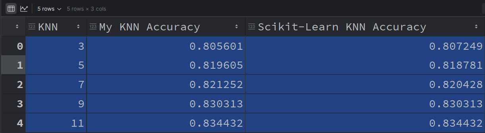
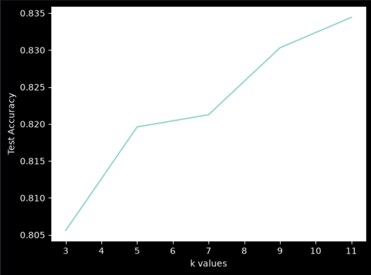

# Projects
This is My Machine Learning Repository where I will be sharing my projects and learnings in the field of machine learning.

## KNN - Small Project
This project implements the K-Nearest Neighbors (KNN) algorithm to classify clothing items based on their width and height. The dataset consists of three classes: shirts, pants, and hats.

## KNN - ANSUR II Project
This project implements the K-Nearest Neighbors (KNN) algorithm to Predict Gender from weight and height.

## Author
Created by Sajjad Saljoughi

